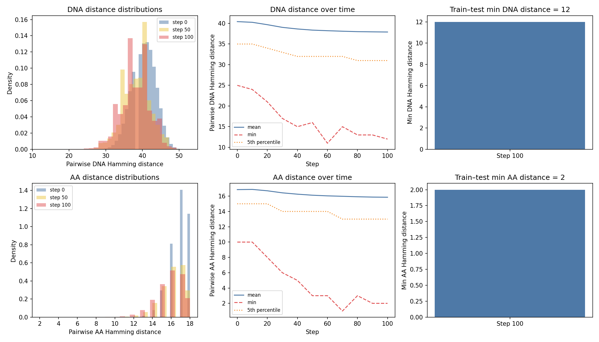
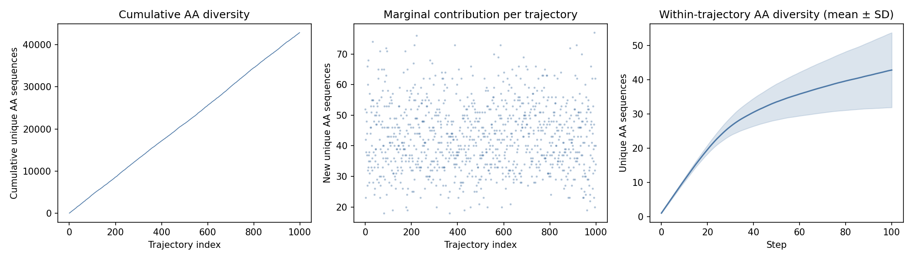
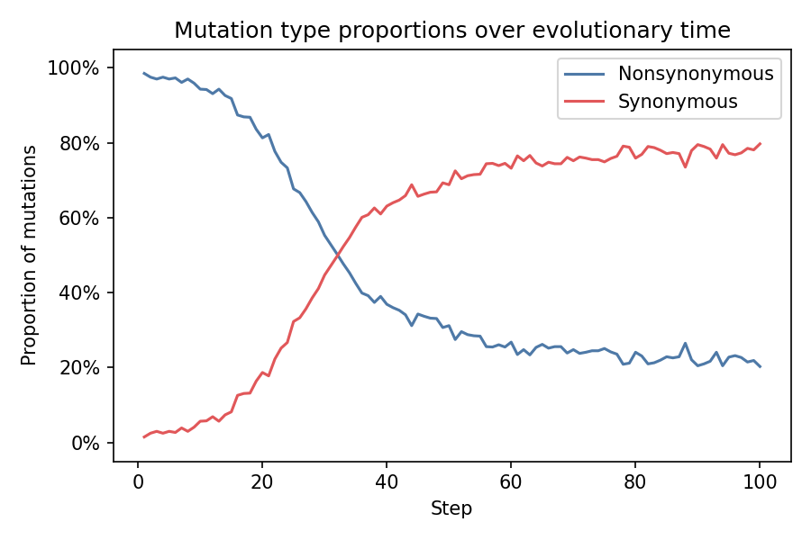

# Analysis

Summary analyses for completed trajectory batches. Scripts live in
`analysis/scripts/` and are run from the repo root:

```bash
python analysis/scripts/summarize_batch.py results/trellis-18aa-KEMN
python analysis/scripts/mutation_types.py results/trellis-18aa-KEMN
```

Figures are written to `analysis/figures/`.

## Batch: trellis-18aa-KEMN (1000 trajectories, 18-mer, ligand KEMN)

### Convergence



Pairwise Hamming distances confirm that 1000 trajectories on 18-residue chains
are not converging to shared sequences. At step 100, the minimum pairwise DNA
Hamming distance across all trajectories is 12 (out of 54 nt) and the minimum
AA distance is 2 (out of 18 residues). Between the train and test splits
specifically, the minimums are the same — no train/test bleed-through.

The distance distributions shift left over evolutionary time, likely because
selection reshapes AA composition away from the codon-table-biased starting
distribution toward AAs favored by the MJ potential and ligand. This shared
compositional drift reduces pairwise distances without implying sequence-level
convergence. Distances remain well separated, with the 5th percentile DNA
distance staying above 20 throughout.

### Sequence diversity



The cumulative unique AA sequence count is still climbing steeply at trajectory
1000, reaching ~43,000 unique AA sequences with no sign of saturation. Each
trajectory contributes ~40-50 new unique AA sequences on average. The
within-trajectory diversity curve shows rapid exploration in the first ~40
steps, then a plateau around 40 unique AAs per trajectory as the chain settles
near a fitness peak.

These results indicate that the 18-mer sequence space (20^18 possible AA
sequences) is far too large to be saturated by 1000 trajectories of 100 steps,
and there is no risk of train/test overlap at this scale.

### Mutation types



Proportion of nonsynonymous vs synonymous fixed mutations at each step,
averaged across all 1000 trajectories. The trajectory divides into two
distinct regimes:

1. **Adaptive climb (steps 1–35):** Nearly all fixed mutations are
   nonsynonymous (~98% at step 1), reflecting strong directional selection as
   sequences climb from random starting points toward fitness peaks. Each AA
   substitution improves folding stability or ligand binding.

2. **Nearly neutral dynamics (steps 35–100):** Synonymous mutations dominate
   (~75–80%), indicating that trajectories have largely reached local fitness
   peaks. Most available nonsynonymous mutations are now deleterious or nearly
   neutral, so the codon-level drift of synonymous changes accounts for the
   majority of fixed substitutions.

The crossover at ~step 35 aligns with the within-trajectory diversity plateau
in the sequence diversity analysis — both reflect the transition from rapid
adaptive exploration to slow neutral wandering near a fitness optimum.
